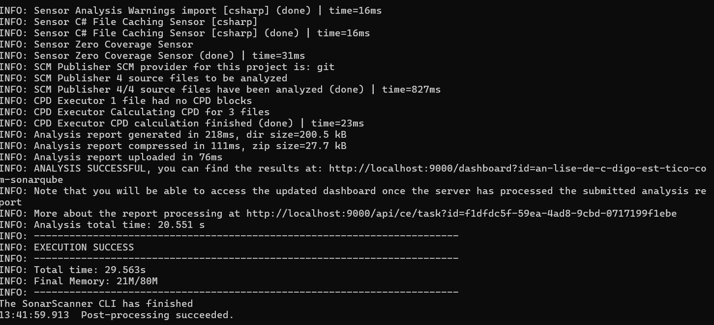
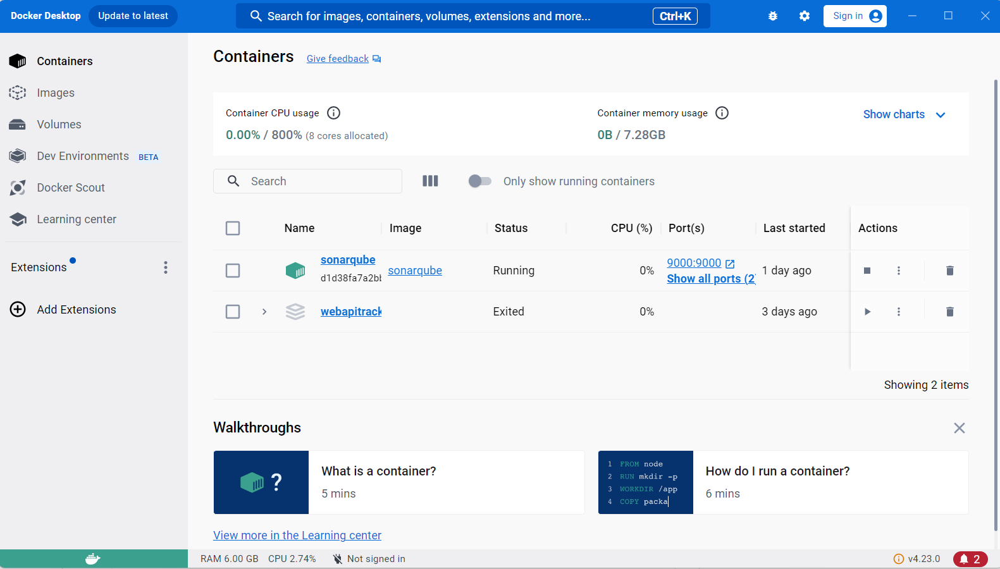
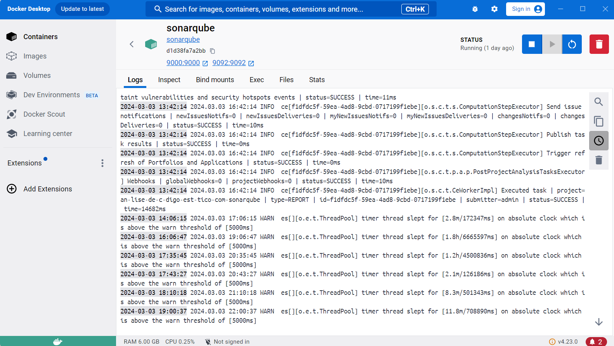
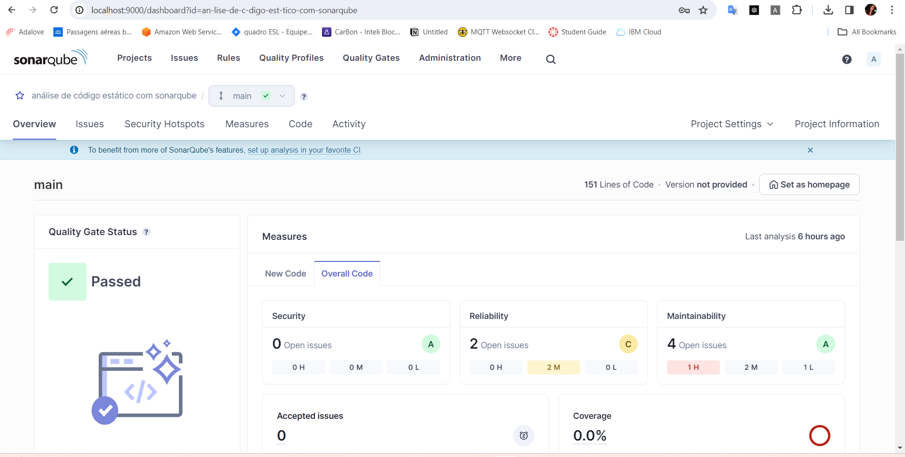

# Relátorio ponderada de sonarqube

## Imagens de prova

## Rodando o projeto através do terminal
</img>

### Container rodando em docker
</img>

### Sonarqube rodando em docker
</img>

### Inicial do Sonarqube depois do projeto criado
Página com painel de visualização das métricas 

</img>

## Aprendizado
- Aprendi sobre Sonarqube e as métricas de código que apresenta, métricas como, segurança, confiabilidade, manutenibilidade, cobertura de testes e duplicações
- Importância de boas práticas de código e revisão de código para garantir segurança e essas análises podem ajudar mostrando as vulnerabilidades e ajudar a consertar os problemas mais fáceis 
